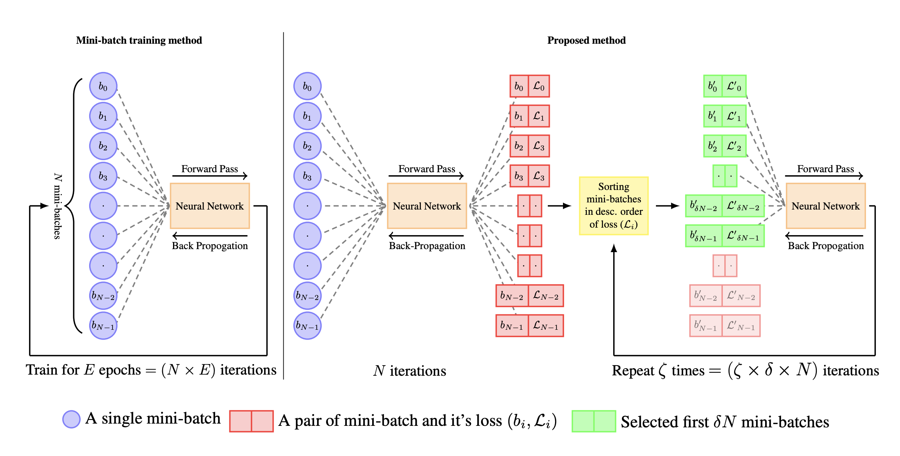

## DyBAT: Learning better representations through **Dy**namic selecting **BAT**ches 
<a href="https://arxiv.org/abs/2304.03486"></a>

Preprint Link: [Can we learn better with hard samples?](https://arxiv.org/pdf/2304.03486v1.pdf)

Authors: [Subin Sahayam](), [John Zakkam]() and [Umarani Jayaraman]()

In assciation with Computer Vision and Machine Learning Lab, IIIT Kancheepuram, India



### Abstract
In deep learning, mini-batch training is commonly used to optimize network parameters. However, the traditional mini-batch method may not learn the under-represented samples and complex patterns in the data, leading to a longer time for generalization. To address this problem, a variant of the traditional algorithm has been proposed, which trains the network focusing on mini-batches with high loss. The study evaluates the effectiveness of the proposed training using various deep neural networks trained on three benchmark datasets (CIFAR-10, CIFAR-100, and STL-10). The deep neural networks used in the study are ResNet-18, ResNet-50, Efficient Net B4, EfficientNetV2-S, and MobilenetV3-S. The experimental results showed that the proposed method can significantly improve the test accuracy and speed up the convergence compared to the traditional mini-batch training method. Furthermore, we introduce a hyper-parameter delta - $\delta$ that decides how many mini-batches are considered for training. Experiments on various values of $\delta$ found that the performance of the proposed method for smaller $\delta$ values generally results in similar test accuracy and faster generalization. We show that the proposed method generalizes in 26.47% less number of epochs than the traditional mini-batch method in EfficientNet-B4 on STL-10. The proposed method also improves the test top-1 accuracy by 7.26% in ResNet-18 on CIFAR-100.

### Results and Checkpoints

Test Top-1 Accuracy on CIFAR-10

| Model | # of Params (M) | FLOPs (G) | $\delta$ | Top-1 (%)|
|:---:|:---:|:---:|:---:|:---:|
| ResNet-18 | 11.18 | 1.19 | 1.0 | [69.6 $\pm$ 0.9 ]() |
| ResNet-18 | 11.18 | 1.19 | 0.5 | [69.2 $\pm$ 1.0 ]() |
| ResNet-50 | 23.52 | 2.69 | 1.0 | [63.1 $\pm$ 1.1 ]() |
| ResNet-50 | 23.52 | 2.69 | 0.5 | [64.6 $\pm$ 1.0 ]() |
| EfficientNet B4 | 17.56 | 0.98 | 1.0 | [52.6 $\pm$ 0.7 ]() |
| EfficientNet B4 | 17.56 | 0.98 | 0.8 | [54.2 $\pm$ 1.0 ]() |
| EfficientNet V2 Small | 20.19 | 1.86 | 1.0 | [56.5 $\pm$ 1.1 ]() |
| EfficientNet V2 Small | 20.19 | 1.86 | 0.8 | [53.8 $\pm$ 1.1 ]() |
| MobileNet V3 Small | 1.52 | 0.03 | 1.0 | [55.4 $\pm$ 1.1 ]() |
| MobileNet V3 Small | 1.52 | 0.03 | 0.2 | [53.2 $\pm$ 1.1 ]() |


### Requirements and Usage

#### Installation
```bash
git clone https://github.com/imjohnzakkam/DyBAT
cd DyBAT

# create new conda environment
conda create env --name dybat
conda activate dybat
pip install -r requirements.txt
```

and now you're good to try it out!

#### Training 

Before training make sure your datasets are downloaded in the folder `/data`

```python
python run.py -data [path to data root] -d [dataset name] -c [crop size] -a [architecture] -n [num classes] -e [epochs] -b [batch size] -lr [learning rate] -delta [value of delta] -zeta [value of delta] -device [device to run exps]
```
Example to run an experiment with hyper-parameters:
```python
dataset = cifar10
crop_size = 128
architecture  = resnet18
epochs = 10
batch_size = 64
learning_rate = 0.001
delta = 0.5
device = 0
```
you would run:
```python
python run.py -d cifar10 -c 128 -a resnet18 -e 10 -b 64 -lr 0.001 -delta 0.5 -device 0
```

The logs would be logged in [wandb](https://wandb.ai) and in `logs/`

### Citation
```bibtex
@article{sahayam2023can,
  title={Can we learn better with hard samples?},
  author={Sahayam, Subin and Zakkam, John and Jayaraman, Umarani},
  journal={arXiv preprint arXiv:2304.03486},
  year={2023}
}
```